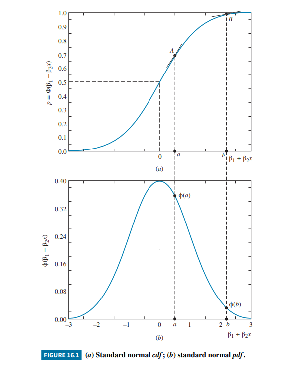

## Slide 1: Introduction

**Focus:** Shifting from continuous dependent variables to models explaining economic choices and constrained data.

* **Qualitative Choices:** Many decisions in microeconomics are "either-or" binary choices (e.g., attending college, buying a house).
* **Limited Dependent Variables:** Some continuous variables have constrained ranges or are incompletely observable, invalidating standard OLS.

::: {.notes}
This chapter explores microeconomic choice models where traditional linear regression fails. We will cover binary choice models (probit and logit), multinomial choices, ordered choices, count data models, and methods for handling censored or truncated data samples.
:::

---

## Slide 2: Models with Binary Dependent Variables

* **Binary Indicator Variable:** $y_i = 1$ if alternative one is chosen, $y_i = 0$ if alternative two is chosen.
* **Choice Probability:** $P(y_i = 1 | \mathbf{x_i}) = p(\mathbf{x_i})$, where $0 \le p(\mathbf{x_i}) \le 1$.
* **Probability Function:** $$f(y_i | \mathbf{x_i}) = p(\mathbf{x_i})^{y_i} [1 - p(\mathbf{x_i})]^{1 - y_i}$$

::: {.notes}
Unlike predicting a continuous quantity, modeling binary choices requires us to predict the probability that a specific choice is made. The explanatory variables (factors like income or price) influence this probability.
:::

---

## Slide 3: The Linear Probability Model (LPM)

**Equation:** $E(y_i | \mathbf{x_i}) = p(\mathbf{x_i}) = \beta_1 + \beta_2 x_{i2} + \dots + \beta_K x_{iK}$

* **Interpretation:** $\beta_k$ measures the constant change in probability for a one-unit change in $x_k$.
* **Flaws:**
    1. Probabilities can illogically fall outside the $[0, 1]$ interval.
    2. The error term $e_i$ is inherently **heteroskedastic**.

::: {.notes}
The linear probability model applies standard linear regression to binary outcomes. While easy to interpret, it suffers from severe logical inconsistencies since linear functions extend infinitely, whereas probabilities must remain bounded.
:::

---

## Slide 4: LPM Application – Transportation

**Context (Example 16.2):** Choice between driving ($AUTO = 1$) or public transit ($AUTO = 0$).

* **Explanatory Variable ($DTIME$):** Bus travel time minus car travel time.
* **Estimates:** $P(AUTO = 1) = 0.774 - 0.0105 \times DTIME$.
* **Insight:** A 10-minute increase in bus travel time increases the probability of driving by $\approx 0.0105$.

::: {.notes}
This example illustrates the direct application of the LPM. However, if the travel time difference becomes extreme, this estimated linear model will predict probabilities of driving that are greater than one or less than zero.
:::

## Slide 5: Modeling Binary Choices {style="font-size: 0.8em;"}

**The Solution:** To keep choice probabilities strictly within the (0, 1) interval, we use S-shaped (sigmoid) curves.

:::: {.columns}

::: {.column width="60%"}
* **Curve Characteristics:** As $x$ increases, the probability rises rapidly at first, then increases at a decreasing rate to stay below 1.
* **Non-Constant Marginal Effects:** Unlike the LPM, the slope of the probability curve changes depending on the value of $x$.
* **Logic:** Ensures predicted probabilities are always logically bounded.
:::

::: {.column width="40%"}
{width="100%"}
:::

::::

::: {.notes}
Nonlinear models ensure that no matter how large or small the explanatory variables get, the predicted probabilities will always make sense logically.
:::

---

## Slide 6: The Probit Model

**Distribution:** Uses the standard normal cumulative distribution function (cdf), $\Phi(z)$.

**Equation:**
$$P(y_i = 1 | \mathbf{x_i}) = \Phi(\beta_1 + \beta_2 x_{i2} + \dots + \beta_K x_{iK})$$

* **Standard Normal pdf:** $\phi(z) = \frac{1}{\sqrt{2\pi}} e^{-0.5z^2}$

::: {.notes}
The probit model forces the linear index into the standard normal cdf. Because it is a nonlinear function, it cannot be estimated via OLS; it requires Maximum Likelihood Estimation (MLE).
:::

---

## Slide 7: Probit – Marginal Effects

**Marginal Effect (Continuous):**
$$\frac{\partial p(\mathbf{x_i})}{\partial x_{ik}} = \phi(\beta_1 + \dots + \beta_K x_{iK}) \beta_k$$

* **Sign:** Determined strictly by the sign of $\beta_k$.
* **Magnitude:** Largest when $p \approx 0.5$ (maximum uncertainty); smallest when $p$ is near $0$ or $1$.

::: {.notes}
In probit, $\beta$ coefficients are not slopes. To find the actual effect on probability, you must multiply the parameter by the standard normal pdf evaluated at a specific data point.
:::

---

## Slide 8: Discrete Changes and AME

* **Indicator Variables:** For a dummy variable $x_{i3}$:
    $$\Delta p(\mathbf{x_i}) = \Phi(\beta_1 + \beta_2 x_{i2} + \beta_3) - \Phi(\beta_1 + \beta_2 x_{i2})$$
* **Average Marginal Effect (AME):** The sample average of the marginal effect evaluated at every observation.

::: {.notes}
Because marginal effects depend on the specific values of all variables, researchers report effects at sample means, for representative individuals, or the Average Marginal Effect (AME).
:::

---

## Slide 9: Maximum Likelihood Estimation (MLE)

* **Concept:** Finds $\tilde{\beta}$ that maximize the probability of observing the actual sample data.
* **Log-Likelihood:** We maximize the natural log of the likelihood function ($lnL$) for simplicity.
* **Example 16.4:** Using MLE on transport data, the marginal effect of travel time is $-0.032$.

::: {.notes}
There are no simple formulas for probit parameters like OLS. Software uses numerical methods to find the maximum of the log-likelihood function.
:::

---

## Slide 10: The Logit Model

**Distribution:** Uses the logistic cdf: $\Lambda(l) = \frac{1}{1 + e^{-l}}$.

**Probability Equation:**
$$p(x) = \frac{\exp(\gamma_1 + \gamma_2 x)}{1 + \exp(\gamma_1 + \gamma_2 x)}$$

* **Comparison:** Logit and Probit yield different $\beta$ estimates ($\tilde{\gamma}_{Logit} \approx 1.6 \tilde{\beta}_{Probit}$), but similar predicted probabilities.

::: {.notes}
Logit is popular because the logistic cdf has a closed-form mathematical expression, making certain calculations easier and generalizing well to multiple choices.
:::

---

## Slide 11: Hypothesis Testing

* **Wald Test:** Tests joint hypotheses using an asymptotic $\chi^2$ distribution.
* **Likelihood Ratio (LR) Test:** Compares $lnL$ of unrestricted vs. restricted models.
    $$LR = 2(lnL_U - lnL_R) \sim \chi^2(J)$$
* **Example 16.7/16.8:** Testing if Coke and Pepsi displays have equal but opposite effects.

::: {.notes}
Because error variance is normalized in these models, standard F-tests don't apply. We use large-sample chi-square tests like Wald and LR tests.
:::

---

## Slide 12: Endogenous Variables

* **Continuous Endogenous:** Use IV Probit or 2SLS on an LPM.
* **Binary Endogenous:** Use IV/2SLS or bivariate probit.
* **Forbidden Regression:** Plugging first-stage fitted values from a probit into a second-stage probit is **invalid**.

::: {.notes}
Endogeneity requires specialized techniques. Example 16.9 uses mother's education as an instrument for education when predicting labor force participation.
:::

---

## Slide 13: Panel Data Models

* **Fixed Effects:** Probit suffers from the "Incidental Parameters Problem" ($N \to \infty$ with $T$ fixed leads to inconsistency).
* **Conditional Logit:** Bypasses the problem for fixed effects.
* **Random Effects Probit:** Assumes unobserved heterogeneity is uncorrelated with $x$.

::: {.notes}
Panel data techniques aren't perfectly portable to nonlinear models. If individual differences correlate with regressors, conditional logit is preferred over fixed effects probit.
:::

---

## Slide 14: Multinomial Logit (Unordered)

**Context:** Multiple unordered alternatives (e.g., Choice of college type).

**Probability Equation:**
$$p_{ij} = \frac{\exp(\beta_{1j} + \beta_{2j}x_i)}{\sum_{m=1}^{J} \exp(\beta_{1m} + \beta_{2m}x_i)}$$

* **Identification:** Parameters for a base alternative are set to zero.

::: {.notes}
Attributes belong to the individual (e.g., income), and the model estimates a different set of parameter values for each choice category relative to the base.
:::

---

## Slide 15: Multinomial Logit Interpretation

* **Odds Ratio:** $P(y_i = j) / P(y_i = 1) = \exp(\beta_{1j} + \beta_{2j}x_i)$.
* **IIA Assumption:** The ratio of probabilities between two choices is independent of other alternatives.
* **Example 16.12:** Lower grades increase the probability of a 4-year college vs. no college.

::: {.notes}
The IIA assumption is strict; it implies adding a new option doesn't change the relative odds of existing options.
:::

---

## Slide 16: Conditional Logit

**Context:** Explanatory variables describe **attributes of the alternatives** (e.g., price of Coke vs. Pepsi) rather than the individual.

**Equation:**
$$p_{ij} = \frac{\exp(\beta_{1j} + \beta_2 PRICE_{ij})}{\sum_{m=1}^{3} \exp(\beta_{1m} + \beta_2 PRICE_{im})}$$

* **Insight:** Own-price effects reduce selection probability; cross-price effects increase it.

::: {.notes}
In conditional logit, the parameter for an attribute (like price) is constant across all alternatives, capturing its universal effect on utility.
:::

---

## Slide 17: Ordered Choice Models

**Context:** Choices have a natural order but gaps aren't uniform (e.g., Opinion surveys).

* **Latent Variable ($y_i^*$):** $y_i^* = \beta x_i + e_i$.
* **Thresholds ($\mu$):**
    * $y_i = 1$ if $y_i^* \le \mu_1$
    * $y_i = 2$ if $\mu_1 < y_i^* \le \mu_2$
    * $y_i = 3$ if $y_i^* > \mu_2$

---

## Slide 18: Ordinal Probit Example

**Probabilities:** Calculated using the normal cdf $\Phi(\cdot)$.

* **Example 16.14:** College choice (None, 2-year, 4-year) based on grades.
* **Marginal Effects:** The sign of $\beta$ is opposite the effect for the lowest category but aligns with the highest category.

::: {.notes}
The marginal effect on middle categories is mathematically ambiguous and depends on specific data values.
:::

---

## Slide 19: Count Data (Poisson Regression)

**Context:** Dependent variable is a count ($0, 1, 2, \dots$).

* **Conditional Mean:** $\lambda = \exp(\beta_1 + \beta_2 x)$ (guarantees positivity).
* **Poisson Probability:** $P(Y=y|x) = e^{-\lambda}\lambda^y / y!$.

::: {.notes}
Count data cannot be negative. Poisson regression uses MLE to enforce this positive boundary.
:::

---

## Slide 20: Poisson Example & Overdispersion

* **Marginal Effect:** $\frac{\partial E(y_i|x_i)}{\partial x_i} = \lambda_i \beta_2$.
* **Example 16.15 (Doctor Visits):** Age, sex, and insurance status explain visit frequency.
* **Note:** If variance $>$ mean, it's called **overdispersion**; Negative Binomial models are then preferred.

---

## Slide 21: Truncated Regression

* **Truncated Samples:** We only observe $y_i$ and $x_i$ if $y_i$ crosses a threshold (e.g., $y_i > 0$).
* **Failure of OLS:** Produces biased and inconsistent estimates by ignoring the unobserved tail.
* **MLE Solution:** Modifies the pdf to $f(y_i) / \Phi_i$.

::: {.notes}
Truncation literally cuts off a portion of the population, altering the mathematical distribution shape. MLE inflates observed probabilities to compensate.
:::

---

## Slide 22: Censored Samples & Tobit

* **Censored Samples:** $x_i$ is observed for all, but $y_i$ hits a "limit" (often $0$) for many.
* **Tobit Model (Type I):** $y_i = y_i^*$ if $y_i^* > 0$, else $y_i = 0$.
* **OLS Bias:** Deleting zeros or running OLS on the full sample leads to severe bias.

::: {.notes}
Pioneered by James Tobin, this model uses MLE to account for both the mass of zeros and the continuous positive values.
:::

---

## Slide 23: Tobit Interpretation

**Total Marginal Effect:** $\beta_2 \Phi((\beta_1 + \beta_2 x)/\sigma)$.

* **McDonald-Moffitt Decomposition:**
    1. Change in $y$ for those already above the limit.
    2. Change in the probability of crossing the limit.
* **Example 16.16:** Married women's labor supply (hours worked).

---

## Slide 24: Sample Selection (Heckit)

**Problem:** Non-random sampling (e.g., wages only for those who work).

* **Selection Equation (Probit):** $z_i^* = \gamma \mathbf{w_i} + u_i$.
* **Intensity Equation:** $y_i = \beta \mathbf{x_i} + e_i$ (observed only if $z_i=1$).
* **Selectivity Bias:** Occurs if $corr(u_i, e_i) \neq 0$.

::: {.notes}
If the decision to participate is correlated with the outcome intensity, standard regression fails.
:::

---

## Slide 25: Heckman's Two-Step Estimator

1. **Step 1:** Probit on Selection $\to$ Calculate **Inverse Mills Ratio (IMR)**: $\lambda_i = \frac{\phi(\cdot)}{\Phi(\cdot)}$.
2. **Step 2:** OLS on Intensity including IMR: 
   $$y_i = \beta \mathbf{x_i} + \beta_{\lambda}\tilde{\lambda}_i + v_i$$
* **Example 16.17:** Corrects downward bias on returns to education.

---

## Slide 26: Random Utility Models

**Micro-foundations:** Individuals maximize latent utility $U_{ij}$.

* **Binary:** $y_i^* = U_{i1} - U_{i0}$.
* **Link:**
    * Errors = Jointly Normal $\to$ **Probit**.
    * Errors = Independent Extreme Value $\to$ **Logit**.

::: {.notes}
Choice models are rooted in utility theory. Since utility is latent, we model probabilities based on the statistical distribution of unobservable errors.
:::

